<!--Knowledge :

     
-->

<h3 align="left">Languages and Tools:</h3>

 
 
 

 
 
 
 
 
 
 
 
 

 <H1>📨 Contact</H1>

 - [Email](Zak@zmbg.us)
 - [LinkedIn](https://www.linkedin.com/in/zachary-konik/)

<!--
**zakattack02/zakattack02** is a ✨ _special_ ✨ repository because its `README.md` (this file) appears on your GitHub profile.

Here are some ideas to get you started:

- 🔭 I’m currently working on ...
- 🌱 I’m currently learning ...
- 👯 I’m looking to collaborate on ...
- 🤔 I’m looking for help with ...
- 💬 Ask me about ...
- 📫 How to reach me: ...
- 😄 Pronouns: ...
- ⚡ Fun fact: ...
-->
